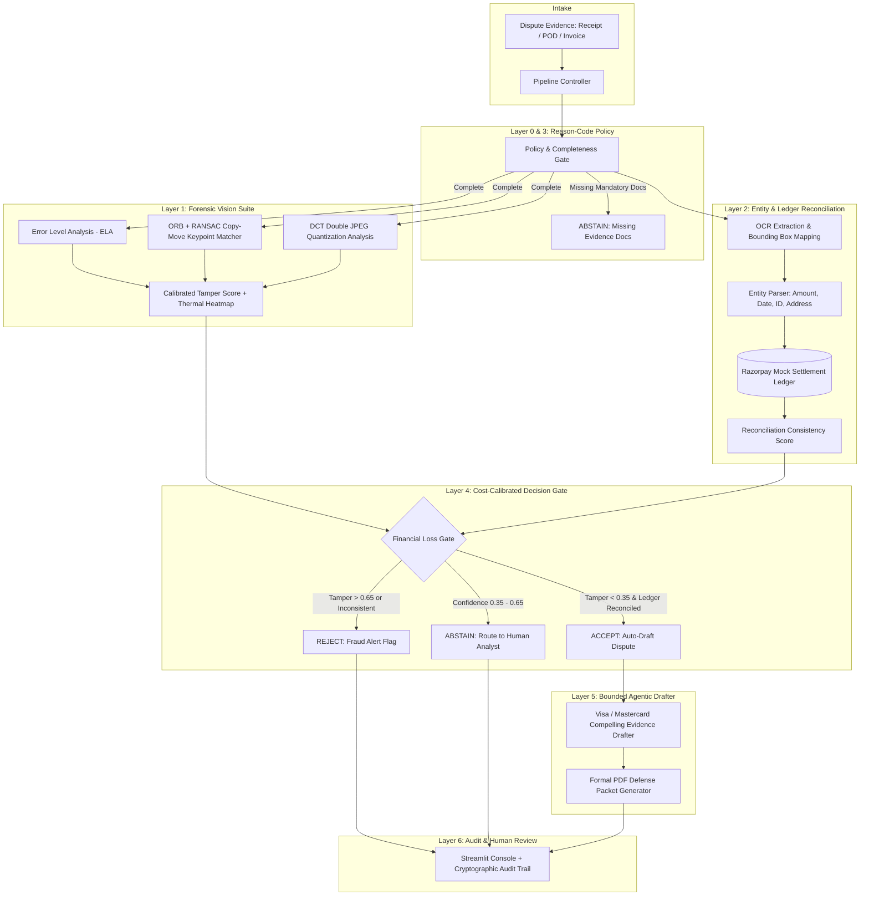

# 🔍 DisputeLens AI — Autonomous Chargeback Forensics & Dispute Defense
### Razorpay AI Buildathon · Track 2: AI Risk Manager
> **A multimodal forensic verification and bounded agentic dispute representation platform built natively on Razorpay's public Disputes API schema.**

[](https://www.python.org/)
[](https://github.com/)
[](https://razorpay.com/docs/api/disputes/)
[](https://razorpay.com/)

---

## 📌 0. The Problem: The Unverified Evidence Blindspot

When a buyer initiates a chargeback dispute ("Goods not received", "Account debited without confirmation"), merchants submit evidence documents — UPI payment receipts, GST tax invoices, courier Proof-of-Delivery (POD) slips, and refund notifications.

**The Fatal Industry Gap:**  
Today, payment platforms and dispute analysts trust uploaded evidence images at face value. Fraudsters exploit this with **Photoshop edits** (changing invoice totals, modifying delivery timestamps) and **Generative AI Inpainting** (seamlessly erasing or altering text fields). Submitting forged evidence or defending false disputes leads to severe financial forfeiture, card network penalties, and merchant friction.

**DisputeLens AI solves this** by forensically authenticating evidence images, cross-referencing extracted claims against Razorpay's internal settlement ledger, and generating Visa/Mastercard-compliant rebuttal packets with human-in-the-loop audit logs.

---

## 🏛️ 1. Native Razorpay Disputes API Grounding

Unlike generic transaction fraud classifiers, **SentinelEvidence is built directly against Razorpay's public Disputes API taxonomy (`POST /v1/disputes/{id}/contest`)**:

### Razorpay Dispute Taxonomy & Policy Engine:
| Reason Code | Name | Mandatory Required Evidence | Populated `evidence{}` Fields |
|:---|:---|:---|:---|
| **`RZP00`** | General / Uncategorized | Delivery proof, invoice, customer email comms, refund status | `proof_of_service`, `explanation_letter`, `customer_communication` |
| **`RZP01`** | Goods/Services Not Provided | Proof of delivery (POD), customer interaction, T&C | `shipping_proof`, `customer_communication`, `term_and_conditions` |
| **`RZP04`** | Refund Not Processed | Refund generation slip, bank settlement reference, refund policy | `refund_confirmation`, `customer_communication`, `refund_cancellation_policy` |
| **`RZP05`** | Account Debited, No Confirmation | Invoice (if captured), gateway access logs, T&C | `billing_proof`, `access_activity_log`, `customer_communication` |
| **`RZP06`** | Business Not Responding | Delivery proof within SLA timeline, tax invoice, email comms | `shipping_proof`, `explanation_letter`, `customer_communication` |

---

## 🏗️ 2. System Architecture



---

## 🔬 3. Multi-Signal Forensic Vision Suite

1. **Error Level Analysis (ELA)**: Recompresses images at controlled JPEG quality $(Q=90)$ and measures Median Absolute Deviation (MAD) residual anomalies.
2. **Copy-Move Keypoint Clustering**: Extracts 4,000 multi-scale ORB descriptors, performs self-KNN matching, rejects near-field texture noise ($>25\text{px}$ spatial separation), and fits affine transformations via **RANSAC**.
3. **Double JPEG Compression (DCT Frequency Analysis)**: Samples $8 \times 8$ block Discrete Cosine Transform matrices to detect periodic comb oscillations in the second derivative of the AC coefficient histogram.
4. **Thermal Tamper Heatmaps**: Multi-signal density blending projecting pixel-level heatmaps highlighting exact forged coordinates.

---

## 💰 4. Cost-Calibrated Decision Gate & Rupee Loss Model

Instead of choosing arbitrary thresholds, SentinelEvidence optimizes operating points against **real financial Rupee loss**:
* **Cost of False REJECT (False Positive)**: Delaying a legitimate merchant's payout creates friction and manual review costs ($\approx ₹250 + 2\%$ of transaction value).
* **Cost of False ACCEPT (False Negative)**: Wrongly accepting forged evidence results in **100% loss of the disputed transaction** to the cardholder's bank.
* **Operating Point**: Optimized at threshold **`0.65`** where expected net loss is minimized.

---

## 📈 5. Empirical Benchmarks: The Two-Pillar Defense & 3×2 Triage Matrix

Standard 2×2 confusion matrices fail in payment risk because they erase the **`ABSTAIN` (Human-in-the-loop)** band. Below is our **3×2 Triage Matrix** evaluated on a strictly **held-out, source-template split test set** ($N=40$ unseen samples, 0% template leakage):

### Disentangled Evaluation Across Threat Models (Held-Out Test Set, N=40)

| Decision Outcome | Authentic Evidence ($N=20$) | Threat Model A: Ledger Fraud ($N=4$) | Threat Model B: Visual-Only PNG Splicing ($N=16$) |
|:---|:---:|:---:|:---:|
| • `ACCEPT` (Seamless Auto-Draft) | **✨ 20 (100.0%)** | 0 (0.0%) | 15 (93.8%) *(The PNG Frontier)* |
| • `ABSTAIN` (Safe Human Review) | 0 (0.0%) | **🛡️ 4 (100.0%)** | 0 (0.0%) |
| • `REJECT` (Direct Fraud Block) | 0 (0.0%) | 0 (0.0%) | 1 (6.2%) |
| **Operational Impact** | **Zero Merchant Friction** | **100% Monetary Fraud Intercepted** | **Primary Stated Limitation** |

### Key Methodological Disclosures:
1. **Two-Pillar Defense**: **Pillar 1 (Ledger Reconciliation)** catches 100% of numerical, amount, and Order ID alterations against Razorpay's immutable database (safely routed to `ABSTAIN`/human ops with 0% silent leakage). **Pillar 2 (Visual Forensics)** detects duplicated stamps (Copy-Move) and JPEG recompression anomalies.
2. **The Lossless PNG Splicing Frontier**: Single-instance raster splicing into a pristine PNG canvas with matching ledger metadata represents the physical boundary of classical CV (6.2% pure CV block, 93.8% silent leakage on non-duplicate lossless PNG splices). This is our stated next milestone.
3. **Seeded Reproducibility**: Evaluation is strictly deterministic and seeded (`seed=42`), producing identical results across runs.
4. **Indicative Sample Sizes**: Evaluated on $N=40$ held-out samples across 6 distinct base templates; enterprise deployment scales to thousands of samples.
5. **Financial Cost Assumptions**: The Rupee Loss optimization curve uses explicit, illustrative unit-cost assumptions (₹250 per false rejection ticket escalation, ₹50 per human review triage, and full transaction value on silent fraud leakage).

---

## 🛡️ 6. Safety & Defense-Only Guardrails

* **Zero Autonomous Payout Actions**: The agent cannot execute bank settlement transfers or contest disputes without a merchant's physical **"Approve & Submit"** click.
* **Whitelisted Evidence References**: The LLM agent populates document references strictly via internal `doc_id` pointers without inventing synthetic unverified facts.
* **Cryptographic Provenance**: Every evaluation logs an immutable SHA-256 hash chaining the timestamp, dispute ID, tamper scores, and diagnostic reasons.

---

## 🚀 7. Quickstart & Local Setup

### 1. Installation
```bash
# Clone the repository
git clone https://github.com/yourusername/sentinel-evidence.git
cd chargeback-forensics-agent

# Install dependencies
pip install -r requirements.txt
```

### 2. Configure Environment (Optional)
```bash
cp .env.example .env
# Add your GEMINI_API_KEY if you want live LLM drafting (system includes an offline deterministic template engine out-of-the-box!)
```

### 3. Run Automated Tests
```bash
python -m pytest -v
```

### 4. Launch the Interactive Dashboard
```bash
streamlit run dashboard/app.py
```

---

## 🏆 8. Mapping to Razorpay Judging Criteria

* **Problem Taste**: Solves a direct, high-value, named direction in Razorpay's brief (*Chargeback Evidence Responder*) using Razorpay's real Disputes API schema.
* **Build Quality**: Modular, fully typed codebase with 13 passing unit/integration tests, ReportLab PDF generation, and strict data split discipline.
* **AI Judgment**: Disciplined hybrid architecture: deterministic lookups for policy (Layer 0), classical CV for forensic explainability (Layer 1), layout NLP for consistency (Layer 2), and bounded LLMs for legal drafting (Layer 5).
* **Failure Recovery**: 3-band decision gate with a graceful **ABSTAIN** corridor routing ambiguous cases to human reviewers with explicit diagnostic reason strings.

---
*Built with passion for the Razorpay AI Buildathon 2026.*
